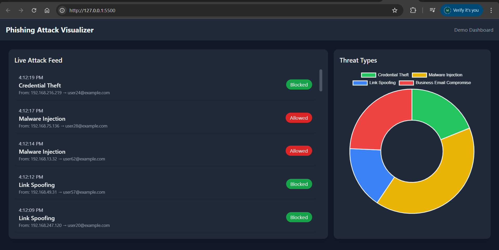

# 🛡️ Phishing Attack Visualizer

A **real-time, single-page dashboard** that simulates and visualizes phishing attacks.  
This project was built as a **UI-focused proof of concept** to showcase web development skills in a **cybersecurity context** .  

---

## ✨ Features
- 📡 **Real-time Simulation** – New phishing attack logs appear every few seconds.  
- 🎨 **Modern Dark UI** – Clean, responsive design styled with TailwindCSS.  
- 📊 **Threat Breakdown Chart** – Interactive Chart.js pie chart for attack categories.  
- 🟢 **Status Highlighting** – Attacks are labeled as Blocked ✅ or Investigating ⚠️ with color-coded UI.  
- ⚡ **Lightweight** – Pure HTML, CSS, and JavaScript, no backend required.  

---

## 🛠️ Tech Stack
- **HTML5**  
- **CSS3** (+ TailwindCSS via CDN)  
- **JavaScript (ES6)**  
- **Chart.js**  
- **Font Awesome**  

